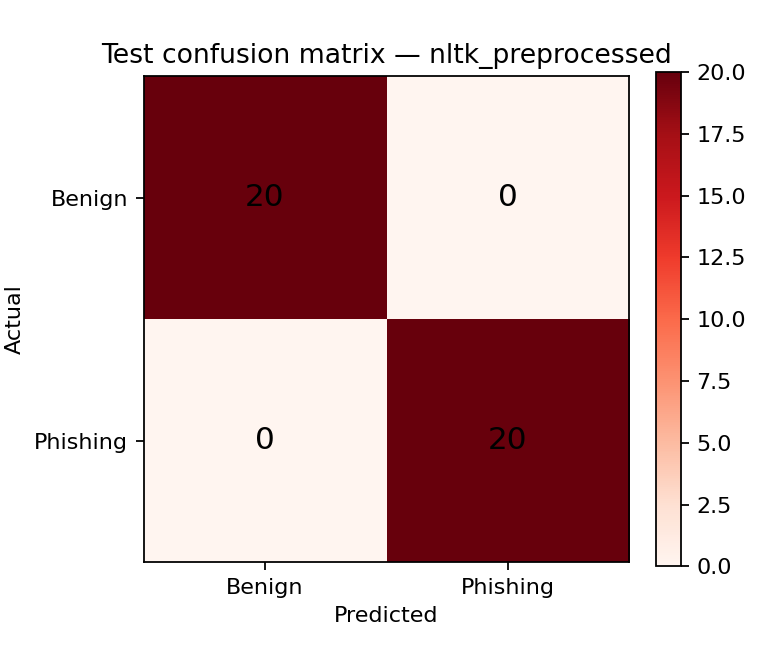

# Phishing Message Detection using NLP

**Name:** Atul Biju
**Class:** S7 AI
**Roll number:** 21
**GitHub:** https://github.com/Atul013/s7-nlp-assignment1/tree/codex/phishing-message-detection/phishing-message-detection

## Abstract

This project implements an English text classifier for educational phishing
message detection. Two leakage-controlled scikit-learn pipelines compare raw
TF-IDF text against meaningful NLTK preprocessing before logistic regression.
On a fixed 40-message held-out test split from a small synthetic corpus, the
selected NLTK pipeline obtained precision, recall, and F1 of 1.0000. That score
must be interpreted cautiously: the corpus contains only 200 balanced,
curated messages with strong templates and is not representative of a live
inbox. A Streamlit demo reports the predicted class, an explicitly uncalibrated
model probability, and model-derived influential terms.

## 1. Introduction and problem statement

Phishing messages imitate trusted entities to obtain credentials, money, or
other sensitive information. Manual review does not scale, while simplistic
keyword rules create false alarms. This course project asks whether a compact,
interpretable NLP baseline can distinguish messages labelled phishing from
messages labelled benign, while preventing common evaluation leakage.

## 2. Objectives

1. Use NLTK meaningfully for tokenization, lemmatization, and selective
   stopword filtering while retaining negation.
2. Compare raw and NLTK-preprocessed TF-IDF logistic-regression pipelines.
3. Deduplicate and split data reproducibly before fitting text transforms.
4. Report precision, recall, F1, a confusion matrix, and error evidence.
5. Provide a reproducible notebook, tests, saved model, and Streamlit demo.

## 3. Dataset, source, and license

The experiment uses the *Phishing and Benign Email Dataset* published on
Hugging Face by Teddyha as a duplicate of darkknight25's dataset. Its dataset
card describes 200 synthetic/curated English messages—100 `phishing` and 100
`benign`—and states an MIT license. Revision `ce65d43` is pinned and the raw
JSONL is verified with SHA-256
`fbc5158d5308c376012a427c7a11d9a2616c6f9b569364d0e5bb085c62b0ff16`.
The class labels are preserved; no spam/ham corpus is relabelled as phishing.

The subject and body are joined. Exact duplicate combined texts are removed
before splitting; this run removed 0 duplicates. The final class distribution
remained balanced at 100/100.

## 4. NLTK preprocessing

The NLTK pipeline lowercases text, replaces URLs and email addresses with
explicit placeholders, uses NLTK's `TreebankWordTokenizer`, removes selected
English stopwords while retaining `no`, `not`, `never`, and related negations,
then applies WordNet lemmatization. Preserving negation avoids turning phrases
such as “do not share” into a misleading positive phrase.

## 5. Methodology and architecture

The fixed random seed is 42. After deduplication, a stratified 60/20/20 split
creates 120 training, 40 validation, and 40 test examples. The split identifiers
are stored in `artifacts/split_ids.json`. Each scikit-learn `Pipeline` contains
its own TF-IDF vectorizer and logistic-regression classifier, so the vectorizer
is fitted only on training text. Features include unigrams and bigrams.

Two candidates are trained: (A) raw text with TF-IDF's lowercase handling, and
(B) NLTK-preprocessed text. Highest validation F1 selects the final model;
validation recall breaks a tie. The test set is not used for selection.

## 6. Implementation

`src/phishdetect/data.py` validates labels, deduplicates, and splits the data.
`preprocessing.py` implements the NLTK transformation. `modeling.py` owns model
construction and metrics. `inference.py` calculates predictions and term-level
linear contributions. `train.py` persists auditable artifacts. `app.py` is the
Streamlit interface. The notebook walks through the same public functions.

## 7. Experiments and actual results

| Pipeline | Split | Accuracy | Precision | Recall | F1 |
|---|---|---:|---:|---:|---:|
| Raw text | Validation | 0.9750 | 1.0000 | 0.9500 | 0.9744 |
| Raw text | Test | 0.9750 | 0.9524 | 1.0000 | 0.9756 |
| NLTK preprocessed | Validation | 1.0000 | 1.0000 | 1.0000 | 1.0000 |
| NLTK preprocessed | Test | 1.0000 | 1.0000 | 1.0000 | 1.0000 |

The NLTK pipeline was selected. Its held-out confusion matrix was `[[20, 0],
[0, 20]]` with zero recorded test errors. The raw baseline misclassified one
benign test message as phishing and no phishing messages as benign.

## 8. Demo and explanation

The Streamlit demo accepts pasted text and shows `phishing` or `benign`, the
model's phishing probability, and the present TF-IDF terms with the largest
absolute coefficient contribution. The interface calls this an *uncalibrated
model probability*, not a security risk score. These contributions describe a
linear model's calculation; they do not prove why a sender wrote the message.

## 9. Error analysis and limitations

The selected model produced no errors on the 40-message test set, so individual
false-positive/false-negative analysis is not statistically meaningful. The
raw baseline's single false positive is saved in `artifacts/test_errors.csv`
only for the selected model (empty) while both confusion matrices remain in
`metrics.json`.

The major limitation is external validity. The dataset is tiny, balanced,
synthetic/curated, and contains repeated stylistic templates. Random splitting
can place related templates across splits, producing an optimistic score.
There is no sender-header, domain-reputation, attachment, image, multilingual,
temporal, or adversarial evidence. Real security notifications may resemble
phishing, and new attacks can use vocabulary absent from training. The model
must not autonomously block mail or guide link/attachment opening. Future work
should add a larger reviewed corpus, group-aware and cross-source evaluation,
temporal testing, calibrated probabilities, and human security review.

## 10. Conclusion

The project meets its educational objective: it demonstrates an auditable NLTK
preprocessing pipeline, a leakage-controlled comparison, reproducible metrics,
and an interpretable local demo. The result shows that the selected pipeline
separates this specific synthetic dataset, not that phishing detection is
solved. Honest scope and validation are therefore part of the deliverable.

## References

1. Teddyha, “Phishing and Benign Email Dataset,” Hugging Face, revision
   `ce65d43`, MIT license. https://huggingface.co/datasets/Teddyha/phishing_benign_email_dataset
2. NIST CSRC, “phishing,” Glossary. https://csrc.nist.gov/glossary/term/phishing
3. S. Bird, E. Klein, and E. Loper, *Natural Language Processing with Python*,
   O'Reilly Media, 2009. https://www.nltk.org/book/
4. scikit-learn developers, “Working With Text Data” and API documentation.
   https://scikit-learn.org/stable/tutorial/text_analytics/working_with_text_data.html
